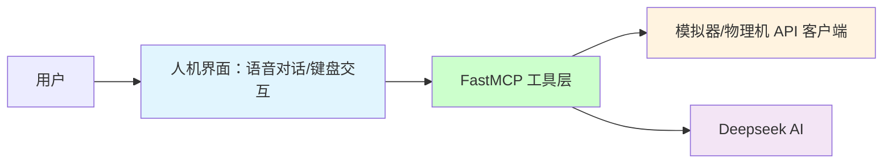

# HUTB 的 MCP 实现

基于 MCP 实现和具身人、无人车、无人机的大模型交互。


## 🏗️ 项目架构




## 1、实现

### 1.1 模拟器的环境搭建

#### 1.1.1 克隆仓库

使用指令
`git clone https://gitee.com/leju-robot/kuavo-ros-opensource.git`
克隆官方仓库。

#### 1.1.2 安装docker

官方提供了一个方便的脚本来安装docker，只需要运行以下命令即可：

```
./install_docker.sh
```

#### 1.1.3 构建容器镜像

根据Dockerfile文件构建容器镜像，运行以下命令：

```
./build.sh
```

若上诉指令运行失败，可以按照以下步骤自行下载导入(推荐)

从[这里](https://gitee.com/link?target=https%3A%2F%2Fkuavo.lejurobot.com%2Fdocker_images%2Fkuavo_opensource_mpc_wbc_img_v0.6.1.tar.gz)下载容器镜像

导入镜像：

```
docker load -i kuavo_opensource_mpc_wbc_img_v0.6.1.tar.gz
```

#### 1.1.4 运行容器

运行容器需要配置一些环境变量，挂载目录等，所以提供了一些运行脚本方便使用。

(推荐)普通运行(cpu)，没有GPU或者没有配置好nvidia-container-toolkit的机器，运行以下命令：

```
./run.sh
```

运行GPU版本，需要配置好nvidia-container-toolkit和nvidia-runtime等环境变量，可以在带GPU的宿主机上mujoco、gazebo等仿真更流畅

```
./run_with_gpu.sh
```

##### 1.1.5 编译

执行`./run.sh`进入容器后，默认在仓库的映射目录/root/kuavo_ws，执行以下命令开始编译：

```
catkin config -DCMAKE_ASM_COMPILER=/usr/bin/as -DCMAKE_BUILD_TYPE=Release # Important! #-DCMAKE_ASM_COMPILER=/usr/bin/as 为配置了ccache必要操作，否则可能出现找不到编译器的情况

source installed/setup.bash # 加载一些已经安装的ROS包依赖环境，包括硬件包等

catkin build humanoid_controllers #会编译所有依赖项
```

注意！在执行`source installed/setup.bash`时，可能会遇到目录不匹配的问题，可以先执行`cd installed`，再执行`source setup.bash`，最后再退回到默认目录进行后续操作。
后续执行`source devel/setup.bash`时若出现类似问题也可按照此方法解决。

#### 1.1.6 仿真运行

使用 mujoco 仿真器

```
source devel/setup.bash # 如果使用zsh，则使用source devel/setup.zsh

roslaunch humanoid_controllers load_kuavo_mujoco_sim.launch # 启动控制器、mpc、wbc、mujoco仿真器
```

**上述所有操作默认ubuntu环境**

#### 1.1.7 手动导入人形机器人模型（windows环境可选）：

* 下载并解压 [MuJoCo](https://github.com/google-deepmind/mujoco/releases) ；
* 运行`simulate.exe model/biped_s100049/xml/scene.xml`


### 1.2 大模型

[基于FastMCP框架的人形机器人智能助手](llm/README.md) 。


### 1.3 流程
加上语音识别和合成的整个工作流依次包括：[麦克风](https://item.m.jd.com/product/100025694525.html) /Web浏览器、 [语音](https://mp.weixin.qq.com/s?src=11&timestamp=1754125763&ver=6150&signature=6MJAq932niAOOc0qQSU0kuIulTwbkRstev6RvAM0Q*v*bGEZEINUcdtIN4zu23ZW71o0-GD1OB7DU7YjJcCqaWt6Iv63U4SKUIy1z1cK3khakAGz-BcQuDzPMdsJEK9P&new=1) 识别（方言、老人言： PaddleSpeech ）、QWen/DeepSeek 大模型、流式语音合成 PP-TTS （语音播报/控制模拟器的模型或实体机器人）。


## 参考

* [基于FastMCP框架的 Github 助手](https://github.com/wink-wink-wink555/ai-github-assistant)

* [carla-mcp](https://github.com/shikharvashistha/carla-mcp)

* [网易云音乐 MCP 控制器](https://modelscope.cn/mcp/servers/lixiande/CloudMusic_Auto_Player)


* [机器人本体的仿真环境使用教程](https://kuavo.lejurobot.com/manual/basic_usage/kuavo-ros-control/docs/4%E5%BC%80%E5%8F%91%E6%8E%A5%E5%8F%A3/%E4%BB%BF%E7%9C%9F%E7%8E%AF%E5%A2%83%E4%BD%BF%E7%94%A8/) 
* [机器人本体三维模型](https://gitee.com/OpenHUTB/kuavo-ros-opensource/tree/master/src/kuavo_assets/models)
* [基于虚幻引擎的PR2机器人集成和调试](sim/README.md)（根据 [OpenSim](https://github.com/OpenHUTB/move) 建模）

* [训练MuJoCo和真实人形机器人行走](https://github.com/rohanpsingh/LearningHumanoidWalking) 
