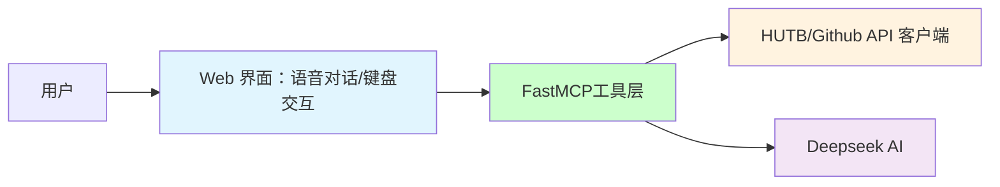

# 人形陪护机器人

聚焦“面向老年人”的高智能陪护机器人研发，围绕“家居服务、安全监护、人机交互、多媒体娱乐”四大核心方向，构建全场景智能陪护解决方案。
通过融合多模态感知、深度交互、健康监测与个性化服务技术，两年半内分阶段实现从功能原型、医疗适配到产品化落地的全链条突破。最终成果将具备情感陪伴、智能看护、主动服务等能力，推动智能养老从“辅助工具”迈向“类人伙伴”。


## 🏗️ 项目架构




## 1、实现

### 1.1 模拟环境搭建

#### 1.1.1 克隆仓库

使用指令
`git clone https://gitee.com/leju-robot/kuavo-ros-opensource.git`
克隆官方仓库。

#### 1.1.2 安装docker

官方提供了一个方便的脚本来安装docker，只需要运行以下命令即可：

```
./install_docker.sh
```

#### 1.1.3 构建容器镜像

根据Dockerfile文件构建容器镜像，运行以下命令：

```
./build.sh
```

若上诉指令运行失败，可以按照以下步骤自行下载导入(推荐)

从[这里](https://gitee.com/link?target=https%3A%2F%2Fkuavo.lejurobot.com%2Fdocker_images%2Fkuavo_opensource_mpc_wbc_img_v0.6.1.tar.gz)下载容器镜像

导入镜像：

```
docker load -i kuavo_opensource_mpc_wbc_img_v0.6.1.tar.gz
```

#### 1.1.4 运行容器

运行容器需要配置一些环境变量，挂载目录等，所以提供了一些运行脚本方便使用。

(推荐)普通运行(cpu)，没有GPU或者没有配置好nvidia-container-toolkit的机器，运行以下命令：

```
./run.sh
```

运行GPU版本，需要配置好nvidia-container-toolkit和nvidia-runtime等环境变量，可以在带GPU的宿主机上mujoco、gazebo等仿真更流畅

```
./run_with_gpu.sh
```

##### 1.1.5 编译

执行`./run.sh`进入容器后，默认在仓库的映射目录/root/kuavo_ws，执行以下命令开始编译：

```
catkin config -DCMAKE_ASM_COMPILER=/usr/bin/as -DCMAKE_BUILD_TYPE=Release # Important! #-DCMAKE_ASM_COMPILER=/usr/bin/as 为配置了ccache必要操作，否则可能出现找不到编译器的情况

source installed/setup.bash # 加载一些已经安装的ROS包依赖环境，包括硬件包等

catkin build humanoid_controllers #会编译所有依赖项
```

#### 1.1.6 仿真运行

使用mujoco仿真器

```
source devel/setup.bash # 如果使用zsh，则使用source devel/setup.zsh

roslaunch humanoid_controllers load_kuavo_mujoco_sim.launch # 启动控制器、mpc、wbc、mujoco仿真器
```

### 上诉所有操作默认ubuntu环境

#### 1.1.7 手动导入人形机器人模型（windows环境可选）：

* 下载并解压 [MuJoCo](https://github.com/google-deepmind/mujoco/releases) ；
* 运行`simulate.exe model/biped_s100049/xml/scene.xml`

### 1.2 流程
[语音](https://mp.weixin.qq.com/s?src=11&timestamp=1754125763&ver=6150&signature=6MJAq932niAOOc0qQSU0kuIulTwbkRstev6RvAM0Q*v*bGEZEINUcdtIN4zu23ZW71o0-GD1OB7DU7YjJcCqaWt6Iv63U4SKUIy1z1cK3khakAGz-BcQuDzPMdsJEK9P&new=1) 识别（方言、老人言： PaddleSpeech ）、DeepSeek大模型、流式语音合成 PP-TTS （控制机器人/模型）

### 1.3 大模型

[基于FastMCP框架的人形陪护机器人智能助手](llm/README.md) 。


## 2、 陪护人形机器人功能定位

| 功能模块                                                                    | 核心需求                                                                                                                                                                                                                        |
|-----------------------------------------------------------------------|---------------------------------------------------------------------------------------------------------------------------------------------------------------------------------------------------------------------------|
| 家居服务                                          | 室内清洁、物品递送等                                                                                                                                                                                                        |
| 安全监护                                          | 跌倒检测、用药提醒等                                                                                                                                                                                                        |
| 人机交互                                          | 智能对话、情感陪伴等                                                                                                                                                                                                        |
| 多媒体娱乐                                          | 戏曲播放、健康课程等                                                                                                                                                                                                        |


## 3、分阶段目标

3.1. 实现对本体机器人二次开发，实现四个功能中基本人机交互、多媒体娱乐等功能。
包括传感器（摄像头/雷达）集成调试。

具体演示功能：视觉与动作融合，使物品分拣、搬空箱子、拿玻璃杯等操作形成闭环；完成语音交互、智能对话等，通过语音提醒戏曲、歌曲播放；机器人基本手势识别，识别动作并完成相应操作。


3.2. 完成具备具身功能的一小批样机（涵盖基础的四个功能），可进行展示


具体演示功能：视觉与动作融合，搬不同重量的箱子、传递物品（语音提示和或者动作提示，如端茶递水等）；完成扫地、拖地板等操作；跌倒检测和用药提醒（到点语音提醒+送药服药确认：AI视觉识别是否吞服）等。


3.3. 结合已有研发成果，对康养陪护机器人四大功能进一步扩展完善，增强各个功能的可靠性、准确性，实现在特定应用场景内的小批量投放使用

完成康养陪护机器人四大功能运行算法优化，增强各个功能可靠性、准确性。

主要功能：

•家居服务：–室内引导、室内清洁、物品递送等

•安全监护：–老人体征监测（心率、血压等）、跌倒监测、用药提醒等

•人机交互：–智能对话、个性化记忆系统、情感陪伴等

•多媒体娱乐：–戏曲播放、健康课程等


具体演示功能：家居服务：室内引导（自动路径规划、避障、自动充电）、室内清洁、物品递送（物品分类整理、倒水等）；安全监护：老人体征监测（心率、血压等）、跌倒监测（辅助起床、递拐杖、助步器、推轮椅等）、用药提醒等；人机交互：智能对话、个性化记忆系统、情感陪伴（自由聊天、歌曲、戏曲播放）等；多媒体娱乐：戏曲播放、健康课程等。


下半年：与合作医院/康养中心共建测试场景，结合实际测试场景进一步优化陪护机器人功能，保障至少10台机器人部署后连续30天无故障运行。


具体演示功能：应用场景调试、综合训练，实际场景需求开发。


3.4. 目标：康养机器人全面产品化与商业化推广，包括模块化设计、功能持续迭代等 2027年上半年任务：实现模块化产品定型，完善功能模块解耦设计（接口标准化），优化供应链成本。

上半年任务：实现模块化产品定型，完善功能模块解耦设计（接口标准化），优化供应链成本。

下半年任务：实现规模化推广，实现首批量产300台的任务（故障率不高于5%）。


## 参考

* [基于FastMCP框架的 Github 助手](https://github.com/wink-wink-wink555/ai-github-assistant)

* [carla-mcp](https://github.com/shikharvashistha/carla-mcp)

* [网易云音乐 MCP 控制器](https://modelscope.cn/mcp/servers/lixiande/CloudMusic_Auto_Player)


* [机器人本体的仿真环境使用教程](https://kuavo.lejurobot.com/manual/basic_usage/kuavo-ros-control/docs/4%E5%BC%80%E5%8F%91%E6%8E%A5%E5%8F%A3/%E4%BB%BF%E7%9C%9F%E7%8E%AF%E5%A2%83%E4%BD%BF%E7%94%A8/) 
* [机器人本体三维模型](https://gitee.com/OpenHUTB/kuavo-ros-opensource/tree/master/src/kuavo_assets/models)
* [基于虚幻引擎的PR2机器人集成和调试](sim/README.md)（根据 [OpenSim](https://github.com/OpenHUTB/move) 建模）

* [训练MuJoCo和真实人形机器人行走](https://github.com/rohanpsingh/LearningHumanoidWalking) 
