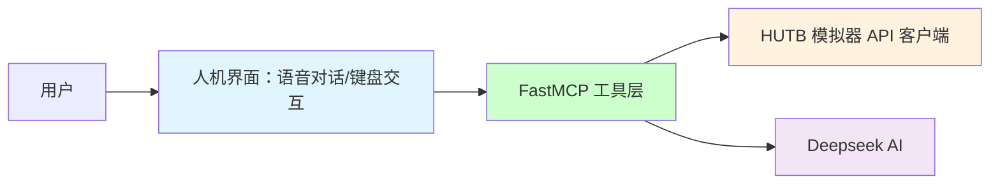

# HUTB 模拟器的 MCP 实现

基于 MCP 实现和具身人、无人车、无人机的大模型交互。


## 🏗️ 项目架构


```mermaid
graph LR
    A[用户] --> B[人机界面：语音对话/键盘交互]
    B --> C[FastMCP 工具层]
    C --> D[HUTB 模拟器 API 客户端]
    C --> E[Deepseek AI]
    
    style B fill:#e1f5fe
    style C fill:#ccffcc
    style D fill:#fff3e0
    style E fill:#f3e5f5
```


## 1. 部署运行

**运行推荐的软硬件**

* Intel i7 gen 9th - 11th+ / AMD ryzen 9+
* +16 GB 内存
* NVIDIA RTX 3070+
* Windows 10/11

双击 [mcp.bat](./mcp.bat) 启动模拟器（第一次启动会下载相关依赖，需要等待一段时间）。

### 1.1 常用对话

**基础操作**
```
连接服务器
设置雨天天气条件
生成车辆
开启自动驾驶
生成行人（默认开启自由移动）
切换视角
切换第三人称视角ID
切换第一人称视角ID
切换旁观者视角
开启录制
结束录制
生成默认网格路网
```

**道路结构场景**
```
构建高速匝道汇入场景
构建高速匝道驶出场景
构建城市车道合并场景
构建城市分合流路口场景
构建城市主辅路场景
```

**路口与特殊形态目标**
```
构建城市十字路口红绿灯场景（支持十字/T型/Y型）
构建隧道场景（自动寻找下穿通道，车辆开车灯）
构建环岛场景
生成儿童行走
生成儿童蹲下 / 躺下 / 打伞（硬摆姿态）
生成自行车倒地 / 摩托车站立 / 摩托车行进
生成救护车 / 警车（特殊任务车辆）
```

**特殊群体、光照与危险行为**
```
生成交警站在车道中央（可伴行）
生成坐轮椅的人（use_wheelchair=True）
设置弱光条件：清晨 / 黄昏 / 阴天 / 夜晚
构建逆光场景（低角度太阳+对向车开大灯）
生成侧翻货车 / 仰翻汽车（货车用Sprinter近似）
构建前车急刹场景
构建危险切入场景
```

**复杂危险场景**
```
构建前车消失场景（前车切出露出障碍）
构建路口行人/机动车/二轮车危险横穿场景
构建前方低重叠率目标场景
构建逆行场景
构建路口无保护通行场景
清理场景
```

**环境限制说明**（工具会返回明确提示）
- 婴儿车、自动配送物流车、动物、施工车辆等无蓝图，调用后返回"无法完成"说明
- 蹲下/躺下/打伞为 set_transform 硬摆姿态（无对应动画）
- 隧道检测目标为桥下/下穿通道（官方地图无地质下沉隧道）
- 运行时切图限制：会话使用过自动驾驶后，需用目标地图重新启动 CARLA 再连接；
  隧道/环岛推荐用 Town04 启动 CARLA（Town03 地图包加载即崩溃，已禁用）

### 1.2 网页快捷按钮面板

启动后浏览器打开 Web 界面（默认 `http://127.0.0.1:3000`），页面顶部
"⚡ 场景快捷按钮"面板按场景类别分组，**点击即直接执行对应场景，
无需输入文字**；另有"连接 CARLA"和"清理场景"按钮。按钮与对话调用的是同一套
MCP 工具（通过 `POST /tool` 接口直达，含连接健康探测与自动重连）。


## 2. 实现

### 2.1 大模型

[基于FastMCP框架的 HUTB 智能助手](llm/README.md) 。


### 2.2 交互增强
（待实现）加上语音识别和合成的整个工作流依次包括：[麦克风](https://item.m.jd.com/product/100025694525.html) /Web浏览器、 [语音](https://mp.weixin.qq.com/s?src=11&timestamp=1754125763&ver=6150&signature=6MJAq932niAOOc0qQSU0kuIulTwbkRstev6RvAM0Q*v*bGEZEINUcdtIN4zu23ZW71o0-GD1OB7DU7YjJcCqaWt6Iv63U4SKUIy1z1cK3khakAGz-BcQuDzPMdsJEK9P&new=1) 识别（方言、老人言： PaddleSpeech ）、QWen/DeepSeek 大模型、流式语音合成 PP-TTS （语音播报/控制模拟器的模型或实体机器人）。

### 2.3 其他：[人形机器人模拟环境搭建](./model/humanoid.md)


## 3. 参考

* [基于FastMCP框架的 Github 助手](https://github.com/wink-wink-wink555/ai-github-assistant)

* [carla-mcp](https://github.com/shikharvashistha/carla-mcp)

* [网易云音乐 MCP 控制器](https://modelscope.cn/mcp/servers/lixiande/CloudMusic_Auto_Player)


* [机器人本体的仿真环境使用教程](https://kuavo.lejurobot.com/manual/basic_usage/kuavo-ros-control/docs/4%E5%BC%80%E5%8F%91%E6%8E%A5%E5%8F%A3/%E4%BB%BF%E7%9C%9F%E7%8E%AF%E5%A2%83%E4%BD%BF%E7%94%A8/) 
* [机器人本体三维模型](https://gitee.com/OpenHUTB/kuavo-ros-opensource/tree/master/src/kuavo_assets/models)
* [基于虚幻引擎的PR2机器人集成和调试](sim/README.md)（根据 [OpenSim](https://github.com/OpenHUTB/move) 建模）

* [训练MuJoCo和真实人形机器人行走](https://github.com/rohanpsingh/LearningHumanoidWalking) 
